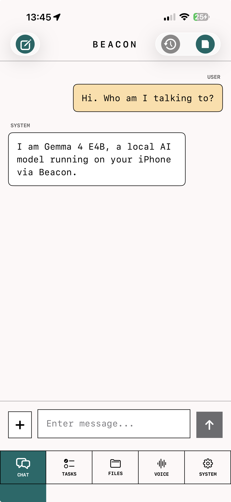
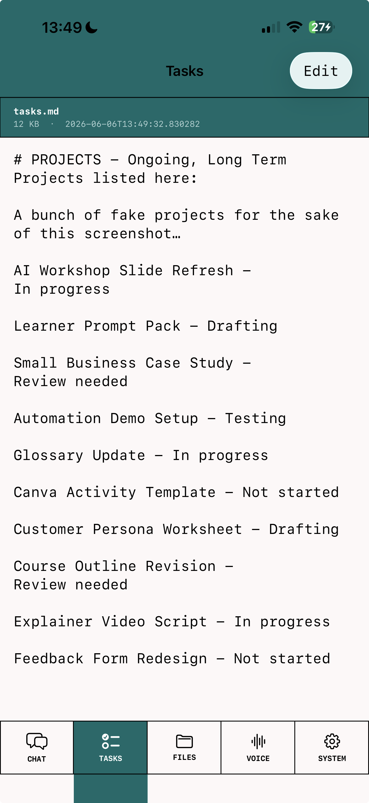
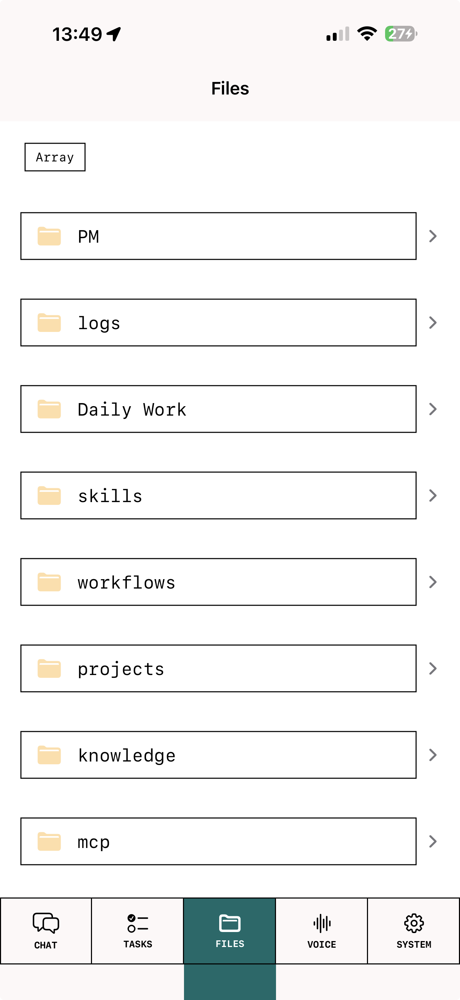
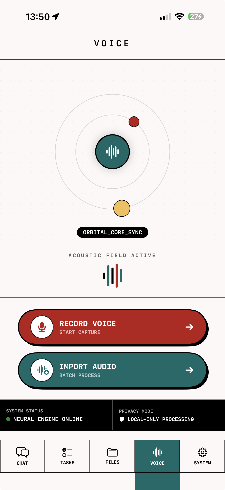
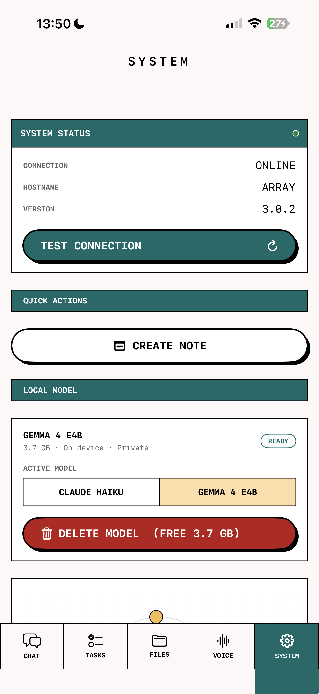

# Beacon

> **Note:** This app is tightly coupled to a specific backend infrastructure and many features won't run out of the box without a similar setup. It's not a product, it's an experiment. But the DIY architecture design philosophy, and on-device AI integration may be of interest to others building similar tools. Or just as a source of amusement for those who actually know how to write code.
The initial spec and following build phases were planned in chats via the claude.ai app. ALL code generated by Claude Opus 4.6, 4.7, and 4.8, Sonnet 4.6, and Haiku 4.5 via the Claude Code plug-in for AntiGravity IDE. Recent UI update generated in Google Stitch and integrated by Gemini 3.5 Flash (high) in AntiGravity IDE.

Beacon is an experimental, personal iOS app. The first I've built in fact. 
It was developed iteratively, sporadically, and as much as a learning exercise as an attempt to un-bung some of my daily workflow bottlenecks. 

It provides multiple avenues for interacting with my home server. The home server in question is a Raspberry Pi5 based system called the Array. 
The Array is exposed via Cloudflare tunnel and various API gateways and acts as my knowledge base. It contains all my research (either PDFs or .md transcripts/summaries) and work related documents (as .md files), as well as various skills.md files, shared to-do lists, and detailed daily activity logs - all of which are accessible to AI agents on both my iPhone and MacBooks. 

Beacon gives me a means of quickly recording new ideas in a space all my agents can access. It provides tools for retrieving and interrogating shared knowledge. It provides a means of interacting with an AI model attached to a persistent shared memory. As someone with galloping ADHD, propping up my own limited working memory was a strong motivator when planning this app.

On-device support for voice transcription and the switch enabling a local model in the chat UI were included as part of my ongoing efforts to reduce the environmental impact of my AI use.

Final UI design system created and refined with **Google Stitch**. 

Built with SwiftUI. Tailscale provides connectivity via mobile data while away from my home wifi network.

## Features

I've been working toward a set of interconnected systems and workflows that increase my efficiency and productivity. One of my goals is to minimise the number of apps I interact with each day (because ADHD). For those reasons Beacon has been given a variety of tools.

- **Chat** — conversational AI via Claude Haiku 4.5 (cloud) or Google's Gemma 4 E4B (on-device), with options to attach URLs or files from the Array as extra context
- **Voice** — record or import audio and transcribe entirely on-device via WhisperKit
- **Tasks** — view and manage tasks from a To-Do List stored on the Array
- **File Explorer** — browse and edit files from the Array
- **PM Mode** — structured project management check-in workflow based on a stored skill.md (`/pm`)
- **Log Mode** — end-of-session logging to the Array's sessions database (`/log`)
- **Quick Notes** — a very simple UI for adding notes as .md files to any folder on the Array

---

## Screenshots

| Chat | Tasks | Files | Voice | System |
|------|-------|-------|-------|--------|
|  |  |  |  |  |

---

## On-Device AI and the slightly idiosyncratic stack

### Chat — LiteRT-LM + Gemma 4 E4B
- Runtime: [LiteRT-LM](https://github.com/google-ai-edge/LiteRT-LM) (Google's edge inference framework, Swift API)
- Model: `litert-community/gemma-4-E4B-it-litert-lm` (~3.7 GB, downloaded at runtime)
- Backend: **CPU only** — GPU backend requires iOS memory entitlements not available on a free developer account and causes `EXC_BAD_ACCESS` without them (~3.4 GB resident vs ~961 MB on CPU)
- KV cache: 8192 tokens max
- Model stored in Application Support, survives app rebuilds

### Transcription — WhisperKit
- Runtime: [WhisperKit](https://github.com/argmaxinc/WhisperKit) (Argmax)
- Model: `large-v3-v20240930_626MB` (~630 MB, downloaded automatically on first use)
- No length limit — WhisperKit chunks audio internally
- Supports any AVFoundation-readable format (m4a, mp3, wav, aiff)

### Key implementation notes
- LiteRT-LM's `ConversationConfig` takes `initialMessages` separately from the current turn — if you add the user message to history before calling `sendMessage`, you must `.dropLast()` to avoid sending it twice
- LiteRT-LM uses `.model` role for assistant turns, not `.assistant`
- Engine self-heals after a null return (unloads and reinitialises on next call)
- PM/Log workflows always route to Claude — their prompts exceed Gemma's KV cache

---

## Privacy

| Feature | Where data goes |
|---------|-----------------|
| Chat — Gemma 4 E4B | Entirely on-device. Nothing leaves the phone. |
| Voice transcription | Entirely on-device via WhisperKit. |
| Chat — Claude | Sent to Anthropic's API. Subject to [Anthropic's privacy policy](https://www.anthropic.com/privacy). |
| Files, tasks, notes | Synced only to your own home server. |

---

## Known Limitations

- **Gemma4 is a tad slow** — expect 20–60 seconds per response on CPU. This is a hardware constraint. The GPU backend would be faster but requires iOS memory entitlements only available on a paid Apple Developer account.
- **First WhisperKit transcription triggers a silent download** — the Whisper model (~630 MB) downloads automatically on first use with no visible progress bar. Subsequent transcriptions are fast.
- **Gemma handles short conversations well; long or complex tasks less so** — the 8192-token KV cache limits context. PM and Log workflows always route to Claude for this reason.
- **Requires a specific backend** — Beacon is built around a custom home server API. Without a compatible backend, most features will fail gracefully but won't function. The backend URL and API key are configured in `ArrayService.swift` and the System tab respectively.

---

## Requirements

- Xcode 16+
- iOS 26.2+ device — built against the iOS 26 developer beta; not tested on earlier versions. Also requires a physical device (not Simulator) as LiteRT-LM needs real hardware.
- Anthropic API key
- A compatible backend API (see above)

## SPM Dependencies

- [LiteRT-LM](https://github.com/google-ai-edge/LiteRT-LM) — on-device Gemma inference
- [WhisperKit](https://github.com/argmaxinc/WhisperKit) — on-device audio transcription

---

## Setup

1. Clone the repo and open `Beacon.xcodeproj` in Xcode
2. Add your provisioning profile under Signing & Capabilities
3. Build and run on a physical device
4. Add your Anthropic API key in the System tab
5. Point the Array API URL to your backend in `ArrayService.swift`
6. Optionally download the Gemma model (~3.7 GB) from the System tab

---

## Contributing

This is a personal tool shared as a reference. Issues and PRs are welcome but may not be addressed promptly — or at all. Fork freely.

---

## Licence

MIT — see [LICENSE](LICENSE).

---

*The name is a nod to the Caretaker's Array from the pilot episode of Star Trek: Voyager. I do think that's cool.*
