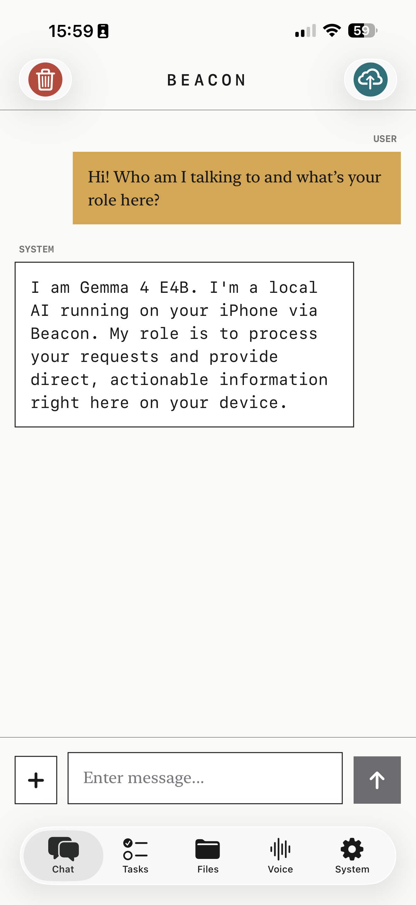
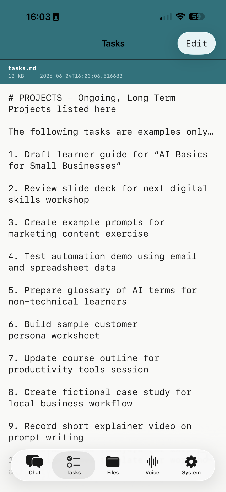
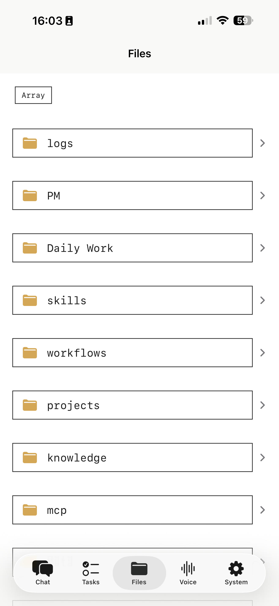
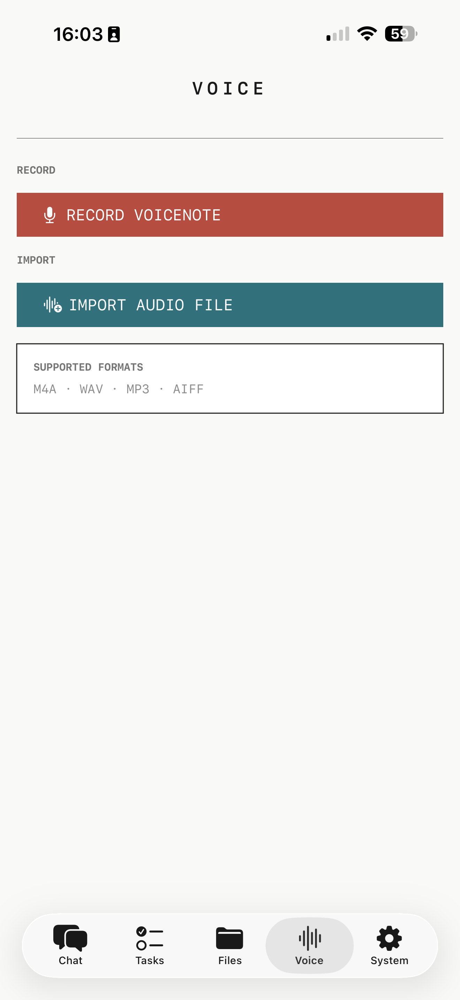

# Beacon

> **Note:** ALL code generated by Claude Opus 4.6, 4.7, and 4.8, Sonnet 4.6, and Haiku 4.5 via Claude Code. This app is tightly coupled to a specific backend infrastructure and many features won't run out of the box without a similar setup. But the diy design philosophy and on-device AI integration may be of interest to others building similar tools. Or just as a source of amusement for those who actually know how to write code. 

Beacon is an experimental, personal iOS app. it was developed iteratively, sporadically, and as much as a learning exercise as an attempt to un-bung some of my daily workflow bottlenecks. It provides multiple avenues for interacting with my home server. The home server in question is a Raspberry Pi5 based system called the array*, exposed via cloudflare tunnel and various API gateways. The array contains all my research (either PDFs or .md transcripts/summaries) and work related documents (as .md files), as well as various skills.md, my to-do lists and detailed daily activity logs, all of which are accessible to AI agents on both my iPhone and MacBooks. Beacon gives me a means of quickly recording new ideas in a space all my agents can access, and of retreiving and interrogating knowledge. On-device support for voice transcription and model switch enabling a local model included as part of my ongoing efforts to reduce the environmental impact of my AI use.

Built with SwiftUI, styled with a simple Mondrian-inspired design system. Tailscale provides connectivity via mobile data while away from my home wifi. 

## Features
In an attempt to minimise the number of apps I use each day (because ADHD) Beacon has been given a variety of tools.

- **Chat** — conversational AI via Claude Haiku 4.5 (cloud) or Google's Gemma4 E4B (on-device), with options to attach URLs or files from the array as extra context
- **Voice** — record or import audio and transcribe entirely on-device via WhisperKit
- **Tasks** — view and manage tasks from a To-Do List stored on the array
- **File Explorer** — browse and edit files from the array
- **PM Mode** — structured project management check-in workflow based on a stored skill.md (`/pm`)
- **Log Mode** — end-of-session logging to the Array's sessions database (`/log`)
- **Quick Notes** - a very simple UI for adding notes as .md files to any folder on the array

---

## Screenshots

| Chat | Tasks | Files | Voice |
|------|-------|-------|-------|
|  |  |  |  |

---

## On-Device AI and the slightly idiosyncratic stack:

### Chat — LiteRT-LM + Gemma 4 E4B
- Runtime: [LiteRT-LM](https://github.com/google-ai-edge/LiteRT-LM) (Google's edge inference framework, Swift API)
- Model: `litert-community/gemma-4-E4B-it-litert-lm` (~3.7 GB, downloaded at runtime)
- Backend: **CPU only** — GPU backend requires iOS memory entitlements not available on a free developer account and causes `EXC_BAD_ACCESS` without them (~3.4 GB resident vs ~961 MB on CPU)
- KV cache: 8192 tokens max
- Model stored in Application Support, survives app rebuilds

### Transcription — WhisperKit
- Runtime: [WhisperKit](https://github.com/argmaxinc/WhisperKit) (Argmax)
- Model: `large-v3-v20240930_626MB` (~630 MB, downloaded automatically on first use)
- No length limit — WhisperKit chunks audio internally
- Supports any AVFoundation-readable format (m4a, mp3, wav, aiff)

### Key implementation notes
- LiteRT-LM's `ConversationConfig` takes `initialMessages` separately from the current turn — if you add the user message to history before calling `sendMessage`, you must `.dropLast()` to avoid sending it twice
- LiteRT-LM uses `.model` role for assistant turns, not `.assistant`
- Engine self-heals after a null return (unloads and reinitialises on next call)
- PM/Log workflows always route to Claude — their prompts exceed Gemma's KV cache

---

## Requirements

- Xcode 16+
- iOS 17+ device (not Simulator — LiteRT-LM requires real hardware)
- Anthropic API key
- A running instance of a backend (or a compatible API) similar to the array

## SPM Dependencies

- [LiteRT-LM](https://github.com/google-ai-edge/LiteRT-LM) — on-device Gemma inference
- [WhisperKit](https://github.com/argmaxinc/WhisperKit) — on-device audio transcription

---

## Setup

1. Clone the repo and open `Beacon.xcodeproj` in Xcode
2. Add your provisioning profile under Signing & Capabilities
3. Build and run on a physical device
4. Add your Anthropic API key in the System tab
5. Point the Array API URL to your backend in `ArrayService.swift`
6. Optionally download the Gemma model (~3.7 GB) from the System tab

---

*I named it after the Caretaker's Array from the pilot episode of Star Trek: Yoyager and I do think that's cool.
